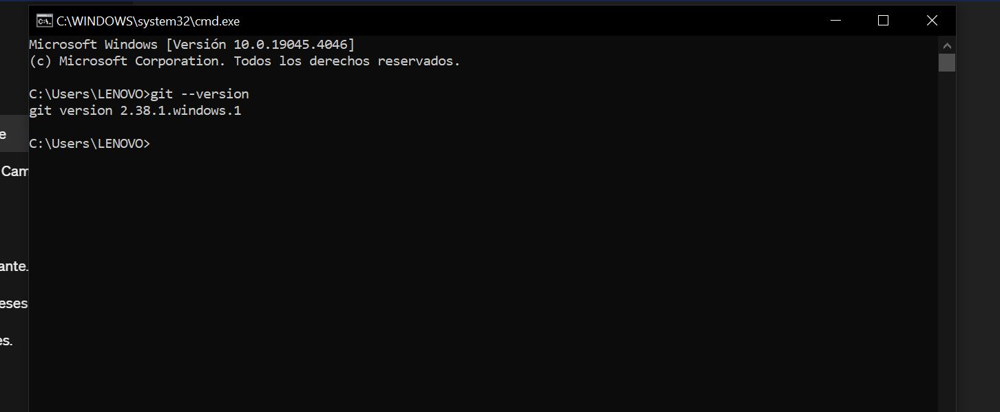
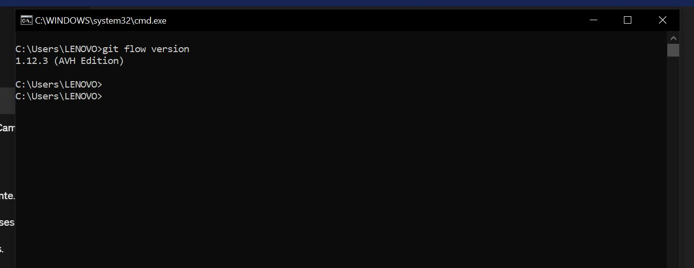
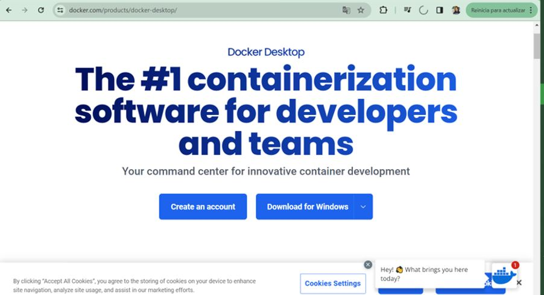
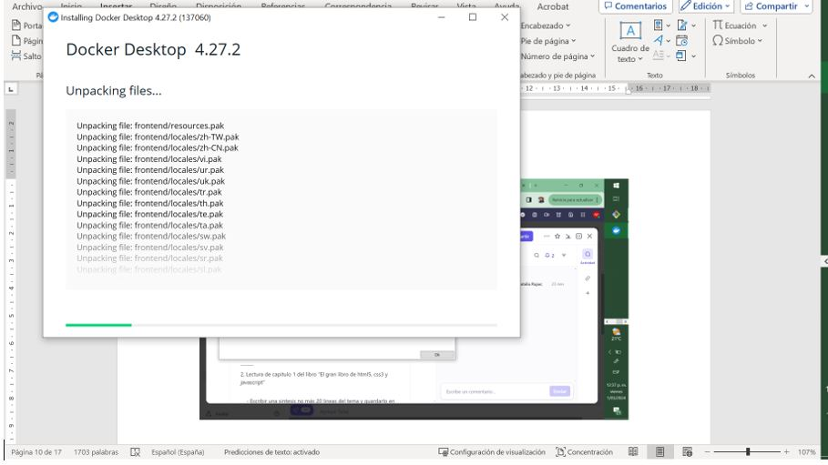
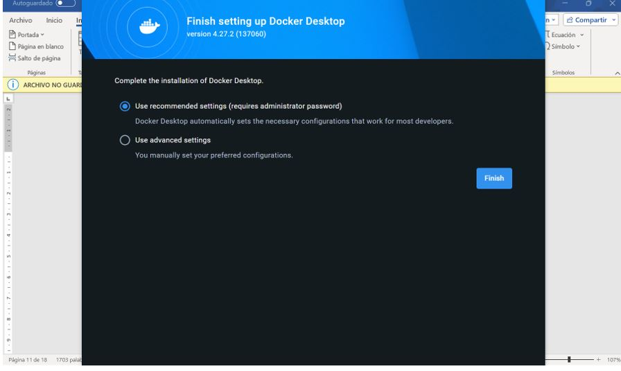
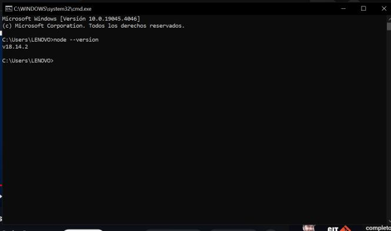
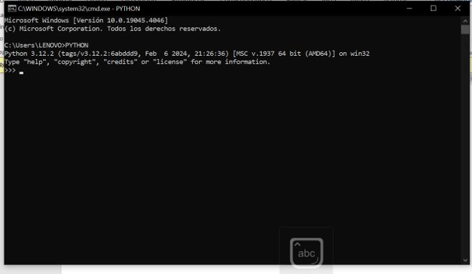
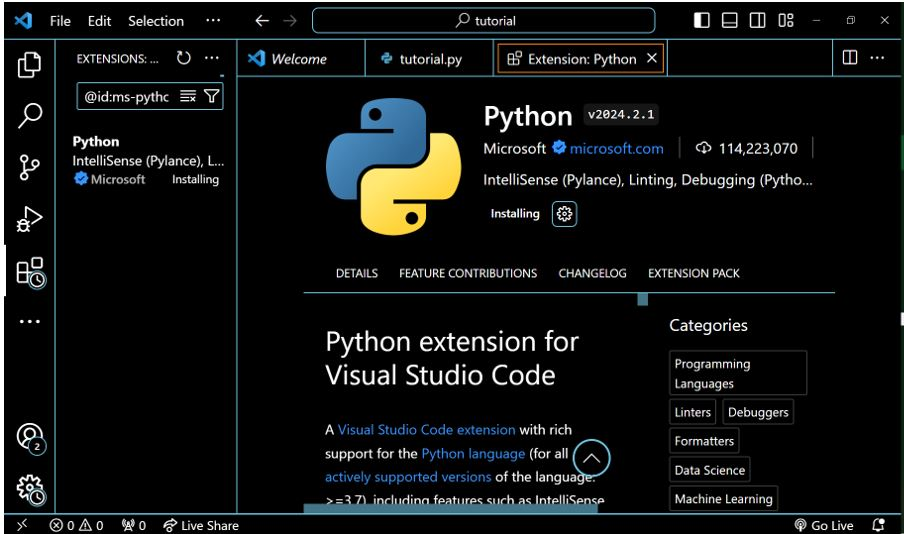

# Prework
En esta carpeta se encuentran las capturas de pantalla de las instalaciones realizadas durante el prework.

## Git
Ya disponía de Git.

## Git Flow
Ya disponía de Git Flow.

## Docker
Capturas de pantalla del proceso de instalación de Docker:

## Node.js
Ya disponía de una instalación activa de Node.js en mi servidor. A continuación, adjunto la versión actual de Node.js en funcionamiento.

## Interprete de Python
Ya disponía con el intérprete de Python en Visual Studio.

